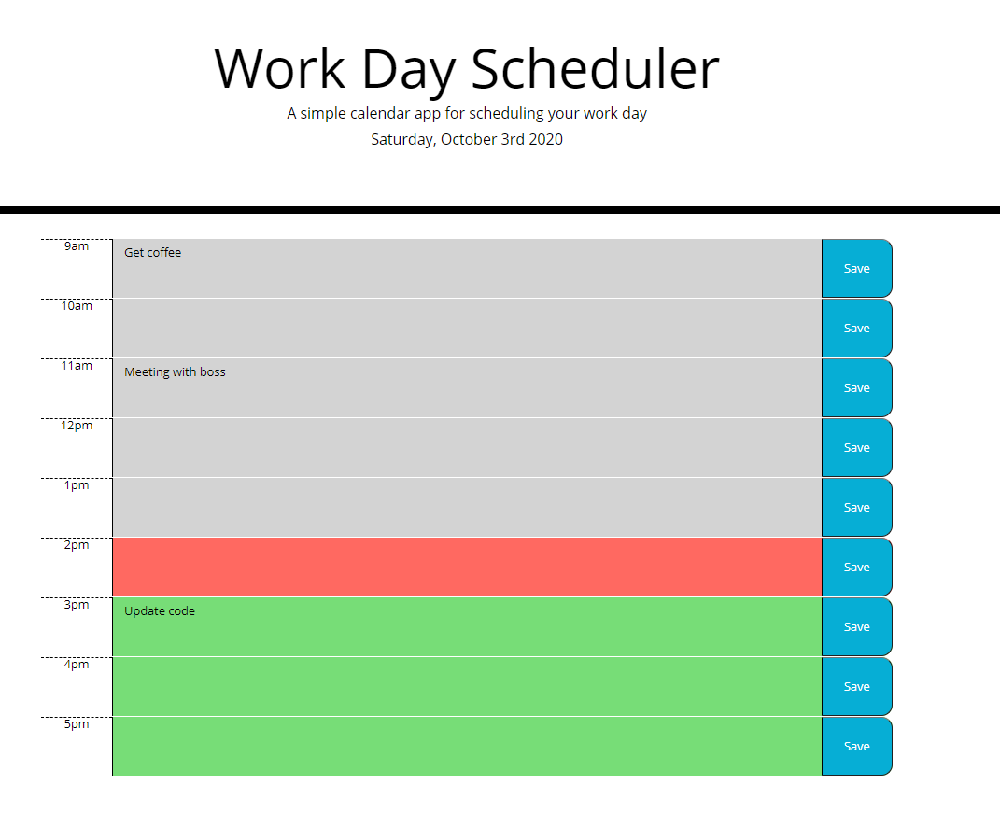

# Work Day Scheduler
​
## Description 
​
I have created a work day scheduler by using Javascript to create elements and update them depending on what the current time and day is.

## How to use

```
On page load, work scheduler is created
User can enter in data for each hour of that day and press save
If the user comes back to the page, it will have any saved data still populated
The scheduler puts any hours in the past in gray, current hour in red, and future in green
The scheduler also displays todays date at the top of the page
```

## Links
GitHub URL: https://github.com/tesssapierce/homework05-work-day-scheduler

GitPage URL: https://tesssapierce.github.io/homework05-work-day-scheduler/

## Screenshots

